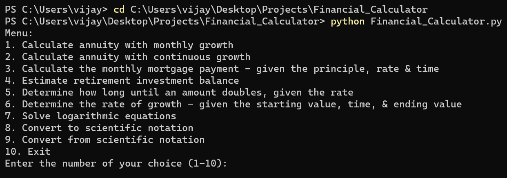
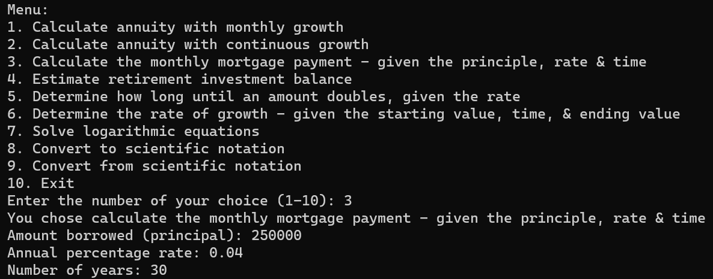
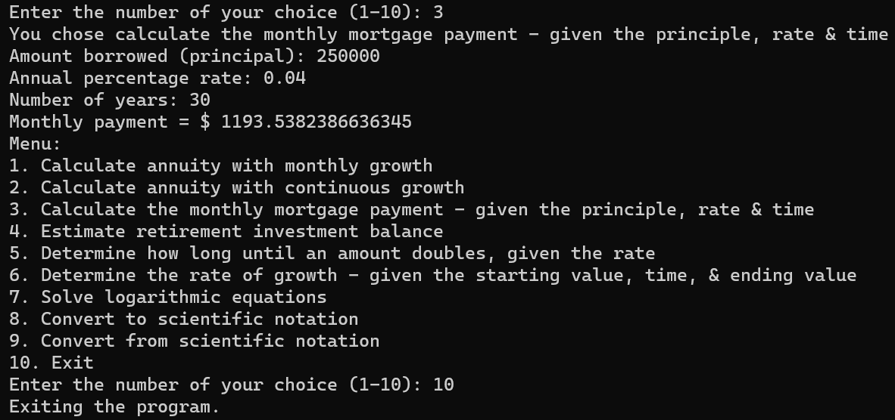

<h1>Financial Calculator</h1>

<h2>Description</h2>
This Python program provides a user-friendly menu for performing financial and mathematical calculations, including annuities, mortgage payments, retirement investment estimation, time to double an amount, rate of growth determination, logarithmic equation solving, and scientific notation conversion. 

<h2>Languages and Utilities Used</h2>

- <b>Python</b>

<h2>Environments Used </h2>

- <b>Windows 11</b>
- <b>Visual Studio Code</b>

<h2>Program walk-through:</h2>

Launch the file:  

 
 

Choose an operation from the list in the menu and input the information for processing:  

 
 

The final answer will be output and you can choose another operation from the menu or enter 10 to exit the program:  

 
 